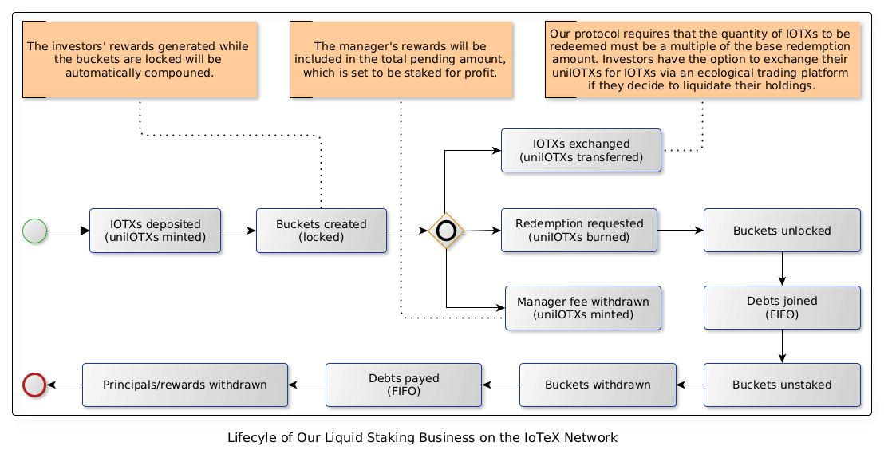

# Design of RockX Liquid Staking Contracts on IoTeX

## Introduction
This document serves the following purposes:
1. It provides an overview of the technical background.
2. It outlines the system-level architecture and contract context.
3. It describes the lifecycle of the liquid staking business.
4. It elaborates on two crucial business processes: 
- The process of depositing IOTX
- The process of redeeming IOTX

## Backgrounds
The following background information is compiled from official materials. For more details, please refer to the relevant websites. 

### The IoTeX Network
[IoTeX](https://iotex.io/) is a blockchain network that employs [Roll-DPoS](https://res.cloudinary.com/dokc3pa1x/image/upload/v1559623484/Research%20Paper/Academic_Paper_Yellow_Paper.pdf?ref=iotex.io) 
consensus mechanism, which enhances the decentralization and security of the IoTeX Network without compromising 
performance by randomly selecting 24 out of the top 36 community-voted Delegates to mine every hour.

### Staking IOTX
Token-holders can [Stake](https://stake.iotex.io/?ref=iotex.io) IOTX and vote for [Delegates](https://delegates.iotex.io/introduction/what-is-a-delegate) to support and expand the network.
This not only strengthens the overall security of the IoTeX Network, but also provides token-holders with significant returns on their staked IOTX.

To start staking you need to decide on several factors:
- Delegate: Each Delegate pay different amounts of rewards. You can switch your vote to another Delegate at any time.
- Amount: This determines the amount of IOTX you wish to stake/vote.
- Stake Duration: This is the amount of time you wish to stake your coins (between 0-1050 days).
- Stake-Lock: When you turn stake-lock ON, you pause your lock duration countdown until you decide to turn it OFF and the countdown resumes.
  
Note: Once the stake duration has expired, the unstaking process takes an additional 3 days. After this you may withdraw your coins to your wallet.

### Liquid Staking
[IIP-13](https://community.iotex.io/t/iip-13-represent-staking-buckets-as-non-fungible-tokens/10262?ref=iotex.io)(IoTeX Improvement Proposal 13)
proposes to natively support the representation of staking buckets as Non-fungible Tokens(NFT) and clears the way for [Liquid Staking](https://docs.lido.fi/?ref=iotex.io#liquid-staking) dApps and interest-earning 
derivatives to flourish in the IoTeX ecosystem.

[SystemStaking](https://github.com/iotexproject/iip13-contracts) is the contract implemented for IIP-13. It issues an 
NFT token for each bucket creation. Owner of the NFT token could update/transfer/unstake the corresponding bucket. 
The buckets created in this contract will be counted in the staking protocol in iotex-core.

## System Architecture and Context
This project is based on the IoTex network. It entails multiple collaborative roles and modules where smart contracts are crucial.

  

## Business Lifecycle
Investors initially need to deposit a certain amount of IOTXs to obtain uniIOTXs, 
which are controlled by the IOTXStaking and UniIOTX contract. 
Subsequently, they can retrieve their assets in two ways:
1. They can visit the exchange to swap uniIOTXs for IOTXs without any restrictions on the quantity.
2. They can submit a redemption request until all principal and rewards have been fully claimed. 
The permissible quantity of IOTXs for redemption is determined by the protocol established in the contracts. 

Staking rewards are generated in both phases: when buckets are locked and unlocked. During the locked phase,
rewards are automatically compounded. In the unlocked phase, investors can claim these rewards.

The manager's fee is deducted from the investors' shared rewards during the locked phase, 
a procedure that is regulated by the IOTXStaking contract.

When investors deposit or redeem IOTX, or when the manager fee is withdrawn, the IOTXStaking contract ensures a constant exchange ratio to prevent user arbitrage.
For a mathematical proof, please refer to this document: [RockX ETH2.0 Liquid Staking Explained](https://github.com/RockX-SG/stake/blob/main/doc/uniETH_ETH2_0_Liquid_Staking_Explained.pdf)

  

## Business Proces: Depositing IOTXs
When investors deposit a certain amount of IOTXs, a corresponding amount of uniIOTXs will be minted, potentially triggering merging operations.
  

## Business Proces: Redeeming IOTXs
The process of redeeming IOTXs involves submitting redemption requests, settling debts and claiming both principal and rewards.

Outstanding debts will be enqueued for future payment once the relevant buckets are unlocked by the IOTXStaking contracts.
The Oracle service collaborates with the IOTXStaking and IOTXClear contracts to manage debt payments.

  

## References
