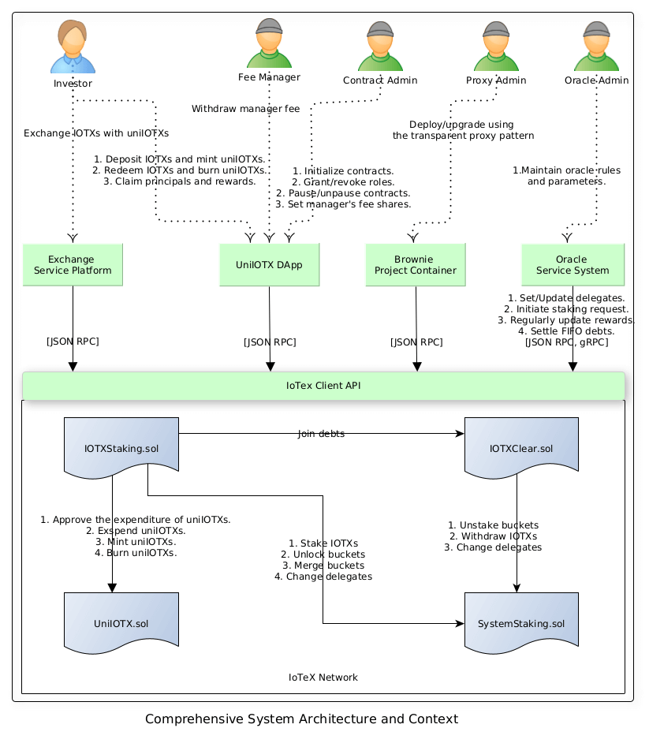

# Design of IoTeX Liquid Staking Contracts
To-Do: This document is awaiting perfection.
## Introduction

## Backgrounds

## System Architecture and Context
This project is based on the IoTex network. It entails multiple collaborative roles and modules where smart contracts are crucial.

  

## Business Lifecycle
Investors initially need to deposit a certain amount of IOTXs to obtain uniIOTXs, 
which are controlled by the IOTXStaking and UniIOTX contract. 
Subsequently, they can retrieve their assets in two ways:
1. They can visit the exchange to swap uniIOTXs for IOTXs without any restrictions on the quantity.
2. They can submit a redemption request until all principal and rewards have been fully claimed. 
The permissible quantity of IOTXs for redemption is determined by the protocol established in the contracts. 

Staking rewards are generated in both phases: when buckets are locked and unlocked. During the locked phase,
rewards are automatically compounded. In the unlocked phase, investors can claim these rewards.

The manager's fee is deducted from the investors' shared rewards during the locked phase, 
a procedure that is regulated by the IOTXStaking contract.

  

## Business Proces: Depositing IOTXs
When investors deposit a certain amount of IOTXs, a corresponding amount of uniIOTXs will be minted, potentially triggering merging operations.
  

## Business Proces: Redeeming IOTXs
The process of redeeming IOTXs involves submitting redemption requests, settling debts and claiming both principal and rewards.

Outstanding debts will be enqueued for future payment once the relevant buckets are unlocked by the IOTXStaking contracts.
The Oracle service collaborates with the IOTXStaking and IOTXClear contracts to manage debt payments.

  

## References
