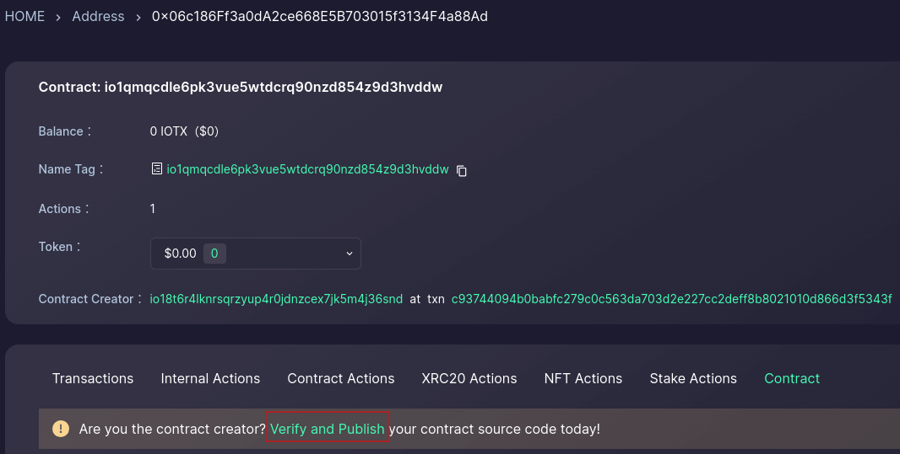
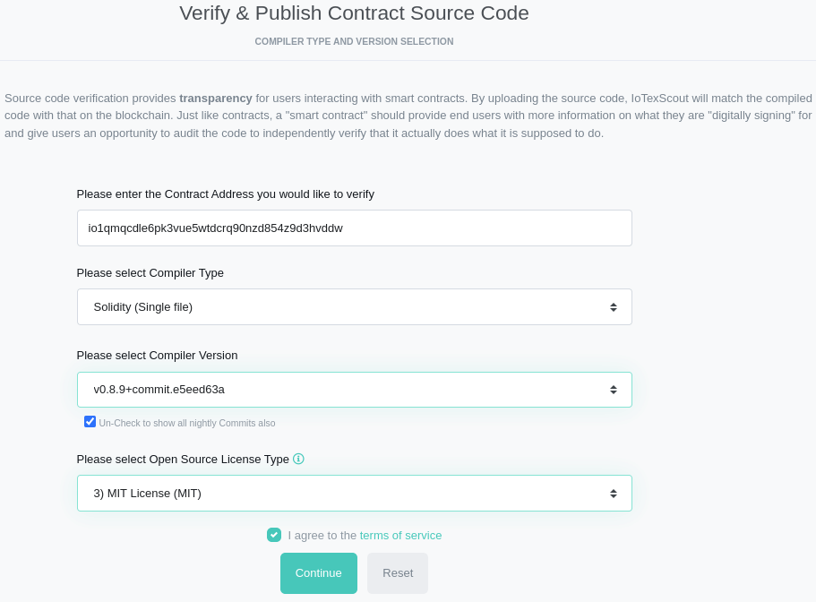
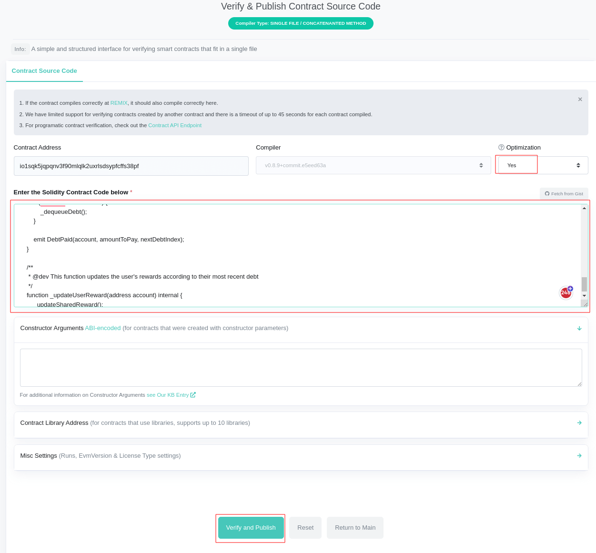

# Guidance to Verify & Publish Contract Source Code

## Align License Identifier
Using mixed license identifiers can lead to failure. We have uniformly adopted the `// SPDX-License-Identifier: MIT` identifier for this project.

## Get Flattened Source Code
From your `brownie console`,  run the flowing commands sequentially:
```
ContractContainer.get_verification_info() 
print(ContractContainer._flattener.flattened_source)
```
Please ensure that the term "ContractContainer" is replaced with the specific contract name, which should be either UniIOTX, IOTXClear, or IOTXStaking, as appropriate.

Copy and paste the latter printed content from the console into the textbox that will be mentioned in the subsequent section of this document.

## Verify & Publish Flattened Source Code
Visit the deployed contract on the IoTeXScan explorer, then verify & publish the flattened source code by following these steps:

 <br>
 <br>
 <br>
 <br>

